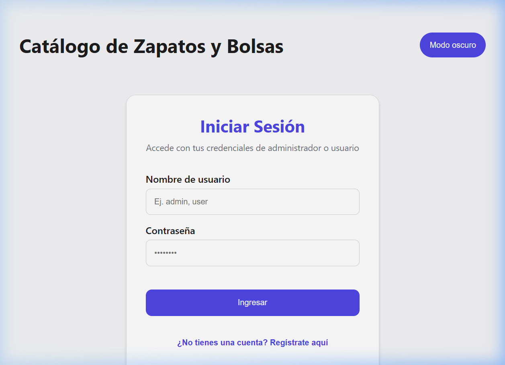
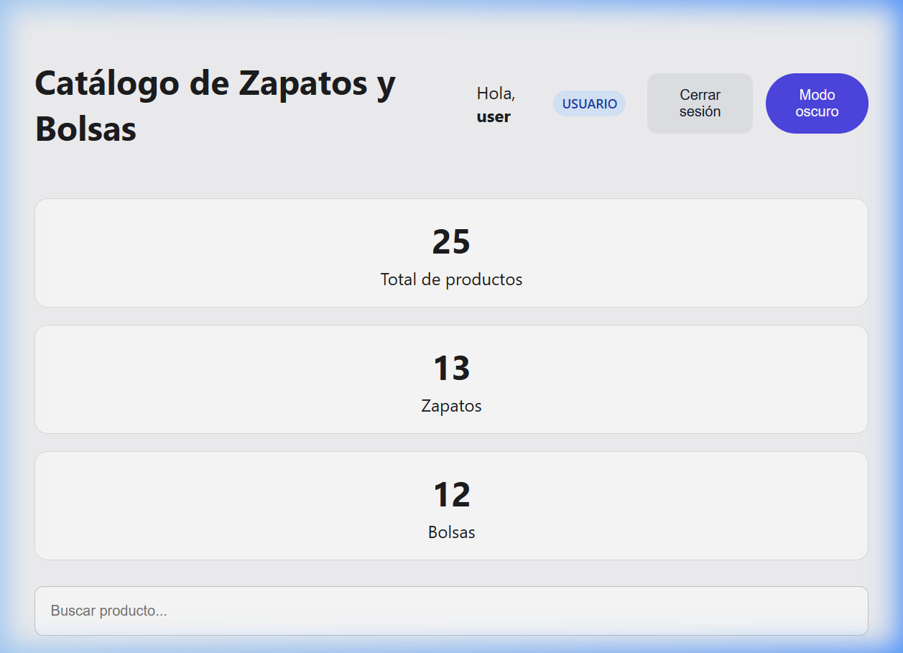
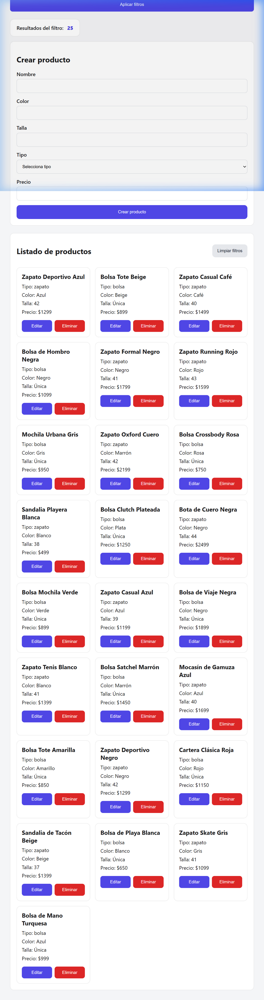
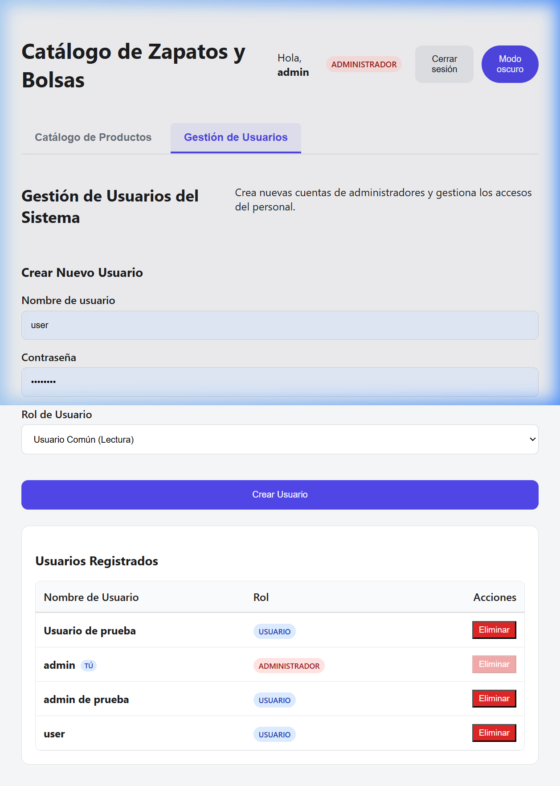

# Catálogo de Productos - Zapatería y Bolsas

Proyecto full-stack para administrar productos de una zapatería con bolsa y zapatos.

## 🚀 Demo en Vivo (Producción)

Puedes acceder a la aplicación desplegada en producción a través del siguiente enlace:

👉 **[Catálogo de Productos en Vivo](https://prueba-tecnica-fork-f-inal.vercel.app/)**

> [!IMPORTANT]
> **Nota sobre la carga inicial (Servidor Gratuito):**
> El servidor del backend está alojado en el plan gratuito de **Render**. Si no ha recibido visitas en los últimos 15 minutos, el servidor entra en estado de suspensión temporal.
> Si al ingresar notas que los productos no aparecen de inmediato o el inicio de sesión tarda, **espera unos 50 segundos** a que el servidor se reactive ("despierte"). Una vez activo, el sistema responderá de forma instantánea.

### Cuentas de prueba:
* **Administrador (Control total):** `admin` / `Admin123!`
* **Usuario Común (Solo lectura):** `user` / `User123!`

## Descripción

Aplicación con backend en NestJS y frontend en React. Permite listar, buscar, filtrar, crear, editar y eliminar productos.

## Vista Previa de la Aplicación

### 1. Pantalla de Inicio de Sesión
El sistema cuenta con un formulario de inicio de sesión y registro público para acceder al catálogo.


### 2. Catálogo de Productos (Rol Usuario Común)
Los usuarios comunes tienen acceso únicamente para visualizar el catálogo, buscar y filtrar productos. El panel no les muestra formularios de edición, creación o eliminación.


### 3. Catálogo de Productos con Controles de Edición (Rol Administrador)
Los administradores pueden visualizar el formulario de creación, y los botones de editar y eliminar en cada producto del catálogo.


### 4. Panel de Gestión de Usuarios (Exclusivo Administradores)
Permite a los administradores crear nuevas cuentas (asignando rol de usuario o administrador) y eliminar usuarios del sistema de forma segura.


## Tecnologías

- Backend: NestJS + TypeScript
- Frontend: React
- Base de datos: MongoDB
- Gestor de paquetes: npm

## Funcionalidades principales

- Listado de productos
- Dashboard con totales de productos, zapatos y bolsas
- Mostrar resultados filtrados
- Búsqueda por nombre
- Filtrado por tipo y precio
- Crear productos
- Editar productos
- Eliminar productos

## 🛠️ Decisiones de Diseño y Alcance (Supuestos)

Para cumplir con una correcta separación de responsabilidades y ofrecer una experiencia de usuario moderna y profesional, se tomaron las siguientes decisiones de desarrollo que complementan y aclaran los requerimientos básicos de la prueba técnica:

### 🌟 Mejoras e Iniciativas Agregadas:
- **Sistema de Autenticación y Autorización (Login/Register):** Aunque el PDF no detallaba un flujo de autenticación, se consideró indispensable implementarlo para garantizar de forma real la separación de responsabilidades y la seguridad de las operaciones entre **Administradores** (lectura y escritura) y **Usuarios Comunes** (solo lectura).
- **Tema Oscuro (Dark Mode):** Se optó por un diseño de interfaz con tema oscuro moderno y armonioso para ofrecer una apariencia visual limpia, profesional y agradable al usuario.
- **Panel de Gestión de Usuarios:** Se diseñó una interfaz interna exclusiva para administradores que permite crear nuevas cuentas (definiendo el rol) y eliminar cuentas de forma segura.

### 🚫 Simplificaciones y Exclusiones Conscientes:
- **Registro Simplificado:** Para mantener la agilidad del flujo y evitar complejidades innecesarias en la prueba técnica, el registro de usuarios solo solicita `usuario` y `contraseña`, omitiendo datos como correo electrónico, nombres o confirmaciones de contraseña.
- **Restricción de Roles en Registro Público:** Por lógica de seguridad, los registros públicos se crean estrictamente con el rol de `usuario`. Solo un administrador autenticado puede designar y crear otros perfiles de administrador desde el panel de control.

## Requisitos

Para ejecutar el proyecto de forma local (sin Docker), necesitas:
- Node.js (v18+)
- npm
- MongoDB corriendo localmente en el puerto 27017

Para ejecutar el proyecto de forma instantánea:
- **Docker** y **Docker Compose**

## Uso

### Opción 1: Ejecutar con Docker (Recomendado y más rápido)

Desde la raíz del proyecto, ejecuta el siguiente comando para construir e iniciar todos los servicios (Base de datos, Backend y Frontend):

```bash
docker-compose up --build
```

Esto descargará la imagen de MongoDB, compilará la API y el Frontend, inicializará la base de datos con los datos de prueba (incluyendo los usuarios) y arrancará la aplicación en:
- **Frontend:** [http://localhost:3000](http://localhost:3000)
- **Backend API:** [http://localhost:5000/api](http://localhost:5000/api)

### Opción 2: Ejecutar de Forma Local

#### 1. Clonar el repositorio e instalar dependencias

En la carpeta raíz:
```bash
npm install
```

En la carpeta `backend`:
```bash
cd backend
npm install
```

En la carpeta `frontend`:
```bash
cd ../frontend
npm install
```

#### 2. Configurar variables de entorno en el Backend

Crea un archivo `.env` en la carpeta `backend` basado en `.env.example`:
```env
PORT=5000
NODE_ENV=development
MONGO_URI=mongodb://localhost:27017/catalogo-productos
JWT_SECRET=unasecretafirmadetokenmassegura123!
```

#### 3. Cargar datos iniciales y usuarios de prueba

En la carpeta `backend`:
```bash
npm run seed
```

#### 4. Iniciar la aplicación

Desde la carpeta raíz, para iniciar el backend y el frontend juntos:
```bash
npm run dev
```

App disponible en `http://localhost:3000`.

### Cuentas de prueba predeterminadas:
* **Administrador (Control total):** `admin` / `Admin123!`
* **Usuario Común (Solo lectura):** `user` / `User123!`

## Organización del proyecto

```
Prueba_Tecnica/
├── backend/      # API NestJS
├── frontend/     # App React
├── DEVELOPMENT_GUIDELINE.md
└── README.md
```

## Modelo de producto

- nombre
- color
- talla
- tipo(bolsa, zapatos)
- precio

## API y Seguridad

Todas las rutas de la API de productos están protegidas mediante **JWT (JSON Web Tokens)**. Las peticiones deben incluir la cabecera `Authorization: Bearer <token_jwt>`.

### Autenticación y Gestión de Usuarios (`/api/auth`)

| Método | Ruta | Acceso | Descripción |
|--------|------|--------|-------------|
| **POST** | `/api/auth/register` | Público | Registra una nueva cuenta con rol de `user` (lectura). |
| **POST** | `/api/auth/login` | Público | Autentica un usuario y devuelve los datos del perfil y el token JWT. |
| **GET** | `/api/auth/users` | Solo `admin` | Obtiene la lista de todos los usuarios registrados. |
| **POST** | `/api/auth/users` | Solo `admin` | Crea una cuenta (con rol `admin` o `user`) desde el panel de gestión. |
| **DELETE** | `/api/auth/users/:id` | Solo `admin` | Elimina una cuenta del sistema (protección contra autoborrado y borrado de admin principal). |

### Catálogo de Productos (`/api/products`)

| Método | Ruta | Acceso | Descripción |
|--------|------|--------|-------------|
| **GET** | `/api/products` | `admin` / `user` | Obtiene los productos (permite parámetros de búsqueda y filtros). |
| **GET** | `/api/products/:id` | `admin` / `user` | Obtiene los detalles de un producto por su ID. |
| **POST** | `/api/products` | Solo `admin` | Crea un nuevo producto. |
| **PUT** | `/api/products/:id` | Solo `admin` | Actualiza un producto existente. |
| **DELETE** | `/api/products/:id` | Solo `admin` | Elimina un producto. |

## Notas

- `npm run seed` en el backend carga los datos iniciales y los usuarios de prueba si la colección está vacía.

